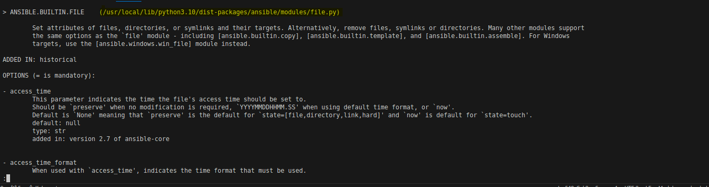

# <ins> Ansible Modules </ins> #

- `Ansible` is a `batteries included framework` and comes with `multitude of modules` covering `verity of different Areas`

- we will starts with the `setup` module 

    - this module is important module for `colecting info` known as `ansible facts`

- then we will learn about the `file module`
    
    - we can use this `file module` for `file related operations`

- then the `color notation used during the ansible execution` module 

- how this related to the `key feaure of ansible` known as the `idempotence`

- then we will learn about the `copy module`

- then we will learn about the `command module`

- then will learn about the `ansible-doc` to `uderstand` the `option available` when we are using the `ansible module`

# <ins> How to Use the Setup Module in Ansible </ins> #

- this `module` is `automatically called` by the `playbooks` , `to gather useful variable` about the `remote hosts` that `variable` can be used `subsequently on the ansible playbook`

- this `module` automatically executed by the `ansible playbook` when `using` the `ansible playbook` to gather `useful info as variable` about the `remote target` and this `gather info as variable` can be used during the `playbook execution`

- we can `call this module directly` with the `ansible command` to see the `variable` that being `available` for the `target host`

- It can also be executed directly by `/usr/bin/ansible` to `check` that `what variables are available to a host`.

- the `info provided by the ansible command with setup module directly (as variables)` are referred as `facts` and `ansible` provide `many facts or info as variable about the remote hosts` about `the system or target host automatically `

- in this course we are using the `linux system as the target hosts` but if we use the `windows machine` as the `target host` it will work as well

- with the `ansible 2.10` a significant `change was intoduced `, called the `ansible collection` , with the `ansible collection` the aim is to `move the grooup of module` into `ansible collection` that can be `managed and maintained`

- the `core module` for `Ansible` such as the `setup module` have been moved to the `ansible.builtin` `collection` which is a `ansible collection` to `maintain or manage` the `group of module` which can be used as `ansible.builtin.setup`

- as its been moved to the `ansible collection` we cn typically refer these as `ansible.builtin.setup` or `short name for these module` which is of `setup`

- but we can also refer these module as `ansible.builtin.setup` module as the `fully qualified name`

- the outcome of both the representation of  both the module signature `ansible.builtin.setup` or `setup` will result in same result 


- the documentation can be fetched in below link

    - [Ansible Setup Module](https://docs.ansible.com/ansible/latest/collections/ansible/builtin/setup_module.html)
    
- lets run this against the `centos1` target host or remote system

- we can define the `ansible.cfg` file and the `inventory hosts file` as below 

    ```
        ansible.cfg
        -----------
        [defaults]
        inventory=hosts #defining the inventory as the hosts file which isin ini format 
        host_key_checking=False #define the host_key_checking=False for automatic fingerprint update

        hosts
        -----
        [control]
        ubuntu-c ansible_connection=local

        [centos]
        centos1 ansible_port=2222
        centos[2:3]

        [centos:vars]
        ansible_user=root

        [ubuntu]
        ubuntu[1:3]

        [ubuntu:vars]
        ansible_become=true
        ansible_become_pass=password

        [linux:children]
        centos
        ubuntu
 
    
    ```

- if we run the `setup` module against the `centos1` target host then  we have to execute the command as `ansible centos1 -m setup `

- here using the `setup module with the option as -m and centos1 is the target host that  we want to target`

- this will provide a `lot of info or the ansible facts i.e variable for the remote hosts` but if we want to shorten it then we can use it as below 

- we can execute the `command` as `ansible centos1 -m setup | more` where we are using the `more` by `piping it` so that we can see more info

- we can see the below `useful info` when executing the command as 

    ```
        ansible centos1 -m setup | more
        # using the below ansible command with the setup module to gather info about each section
        $ this will provide the info as the JSON format as output 

        # we can see info about the remote host ip address  as with `ansible_all_ipv4_address`
        "ansible_all_ipv4_addresses":<ip address of the remote system>

        # we can also see the remote target hosts system architecture and sistribution as well against `ansible_architecture`
        "ansible_architecture":"<architecture i.e amd64 or x86_64>"

    
    ```

- for now understanding the `ansible facts info` is just another `ansible module` is our `main goal`

- we will see that `how to use that ansible facts` that we are getting from the `setup` module in the `later section`


# <ins> How to Use the File Module in Ansible </ins> #

- using the `file module` we can 
    
    - `set attribute of the file`

    - `set attribute of symlink or directories`

    - `we can perform other useful things with the file and symlink`

    - `remove a files`

    - `remove symlink`

    - `remove a directory`

- lets suppose we want to `create the file` on the  `remote system or target host` we can use the `command module` with the `argument` as `unix command touch` in order to create a `zero length file` or `updte the rimestamp of the file`

- using the `file module` with the ` "combination of path and state" ` it will provide the `same outcome` what we want to achieve using the `unix command touch`

- using the below command `with file module` with the `path and state` we can achieve the `same thing` as we have for the `command module using the unix command`

- we can use the `file module` as below 

    ```
        ansible centos1 -m file -a 'path=<path>/<of the file> state=touch'
        # using the file module with the path and state we can achieve the same that has been provided in the `command module using the unix command touch`
        # here this will provide a JSON response and create the file which `co-related to the system time of the ansible host i.e ubuntu-c`

        #ex:-
        ansible centos1 -m file -a 'path=temp/test state=touch'
        # this will create the file based on the system time of the ansible host as the state written s touch
        # like command module we need to provide the `args` with the `quotes` against the `-a args`

    
    ```

- we can also apply this to all the `all host` present in the `all target group` by using the command as `ansible all -m file -a 'path=temp/test state=touch'` rather than doing it for the `cemtos1 target hosts` which will be off `ansible centos1 -m file -a 'path=<path>/<of the file> state=touch'`

- we can `verify that using the command` as `ssh <remote server> <command that we want to execute>` if the `passwordless communication being activated`

- we can use the below command to see all the info as 

    ```
        ssh centos1 -p 2222 ls -althr /temp/test
        # this will list out all the files and subfolder present in the remote host
        # here we have provided the additional command to see all this through which is `ls -althr <path name where we created the file>`
        # with the -p option we can mention the ssh port we want to connect to the remote host
        # here we have the file created co-related to the time stamp of the ansible host client


    ```

- many `other module` support the `same option as the file module` such as 

    - `[copy] module`

    - `[template] module`

    - `[assemble] module`

- for windows target we can use the `[win_file]` module instead of the `file module`

- in the ansible `ansible 2.10` `file module` been moved to `ansible_base` and is classed as `builtin` plugin or `ansible.builtin` collection which is an `ansible collection`

- it can be referenced as the `ansible.builtin.file` as qualified name or `[file]module` only

- the documentation for the module provided in 

    - [Ansible File Module](https://docs.ansible.com/ansible/latest/collections/ansible/builtin/file_module.html)


# <ins> `color notation used during the ansible execution` </ins> #

- when we ran the `file command` then we can see that the output `will be in yellow `

- ansible uses the following `color scheme`
    
    - `red=Failure`

    - `yellow=Success, with changes` 

    - `green=Success , with no changes` 

- when we are using the `file` command then we will get the `output` in `yellow` means the result is a `success` with the `changes` i.e whenever we are using the command as `ansible all -m file -a 'path=<path to the file> state=touch'` thyen we can see always the `result in yellow color means success with changes`

- as the `unix touch command` will `update the timestamp` of the `file` hence there will be a `change`

- if we rerun the ` touch command` again as we are `not creating the file again` but we are updating the `timestamp` that has `changed unix time for the execution` whenever we are using the `touch commnd` as the `file with path and state co-relate to timestamp of the ansible host` hence we can see that one as well by

- `ssh centos1 -p 2222 ls -althr /temp/test` here we can check that the `the timestamp for the file being changed over here as well as in  the remote system`
if we execut the `file command`  as `ansible all -m file -a 'path=temp/test state=touch' ` over and over its been chnages as per the `co-related timestamp of the ansible host client`

# <ins> Different Parameter that can be used against the File module apart from path and state parameter </ins> #

- here we will be using the `different parameter for th file module`

- in linux we have 3 `different type of unix permission` that are 

    - `user i.e the user you are`

    - `group i.e the group against which the file being permitted in `

    - `other i.e everyone else`

- these `3 different unix permission i.e user/groups/others` are devided into `3 different rwx possibility`

    - `r :- read`

    - `w :- write`

    - `x :- executeable`

- each of those `user,group,others/everyone` ahs the `permission` with `rwx` each which can be written as below 

    ```
        user        group       others/everyone # defining the unix permission in here
        rwx         rwx            rwx # defining the rwx possibilty over here
        421         421            421 # defining the rwx value for each unix permission

        # when we set a permission of 60 then it means as below 

        permission 600 means

        rw-         ---               ---
        # here it means the user unix permission will get the value as `4+2`=`6` which means it can support the `read and write on the user unox permission`
        # but the hroup and other/everyone will become empty  as we are providing the `-` in these case 

    
    ```

- if we want to `use this logic to change` the `state of the file that we have created using the file command ` then we can use it as 

- if we have to set the `permission of the file` hence we need to use the `state=file` instead of `touch`

- when we are using the `state=file` then that means file must be present in the `target host or remote system`

- we can execute the `ansible` command as `ansible centos1 -m file -a 'path=<path of the file> state=file mode=600/permission number we want to assign'`

- hence the below code can be written as 

    ```
        ansible centos1 -m file -a 'path=/tmp/test state=file mode=600'
        # this command can be used for changing the file permsiion using the file mosdule of ansible
        # we are using the `state` as the `file` and mode `permission for the unix 3 level permission` 
        # this also provide the output in `yellow` which means the `success with changes`
    
    ```

- if we are `validating` the changes using the `ssh` command for the `remote hosts` as below 

    ```
        ssh centos1 -p 2222 ls -althr /tmp/test
        # thi will show the new permission as below 
        # the permission will be of `-rw-------` as we have the `read and write not executable for the user permission but group and other will remain be empty`
    
    ```

- but if reran the command `ansible centos1 -m file -a 'path=/tmp/test state=file mode=600'` this time the output will be in the `green color` which means the ansible command `got success without any changes`

- if we are running the `command` as `ansible all -m file -a 'path=/tmp/test state=file mode=600` `twice` then we can see that the `green color output saying no changes been made` which means that we have the `local and remote host` file already `mode set` and `nothing being changed`

# <ins> Idempotency </ins> #

- this is an `important feature of ansible` which is known as `idempotence`

- `idemptence` means `an operation is idempotent` 
    
    - if the `result of the performing the operation` is `once`  which is exactly same as the `result of performing it repeatedly` without any `intervening action`

- `idempotency` means, an `operation` can be `idempotent` idf the `result of performing once` will be same as the `result of performing it repeatedly` without any intervening action 

- like the `preveious file command` if we run the `command` multiple time  i.e `over and over agian and again ` and if the file is in the `correct state` then it will `deemed as success`

- `this will help ansible` as `ansible try to connect to various host` which can be in `varying state` , hence the `if ansible can get the desired result or outcome due to the state of the remote hosts` then that task can be `deemed as successful`

- if we want to do the following 

    ```
        
        # lets suppose after running the command as below 
        ansible all -m file -a 'path=/tmp/test state=file mode=600'
        # here we are chaning the file permission to 600 for ll the local as well as the remote servber or remote hosts
        # if we want to change the `file mode` in the `file of out ansible hosts or any other target hosts` then 
        
        # but lets suppose we change the file permission in the `local group` to `644` i.e `-rw-r--r--` by using the command as 
        chmod 644 /tmp/test # this will provide the /tmp/test into the 644 permission over here
        
        #now when we perform the same action once again then we can see the changes as 
        ansible all -m file -a 'path=/tmp/test state=file mode=600'
        # all the rest will be marked as green as the mode not changing or state not changing but the local one will be going to be get changed 
        # hence the localone will be `yellow` where as the green one being in `green` symbol
    
    ```

- when we ran the `ansible with the playbook` then the `playbook will be successful with changes(yellow) or successful without any changes (green)`

# <ins> Copy Module in Ansible </ins> #

- the `[copy] module` used for `copy file`

- the `[copy] module` copies `a file` from the `local or remote target` to a `location in the remote target` i.e we can copy from the `local ansible host client to the rmeote server or we can copy from the rmeote host to the same remote host as well `

- we can use the `[fetch] module` to `copy the file from a remote target to a local target`

- if we need the `variable interpolation of copied file` then we need to use the `[template] module`

- if we wan to `use the window target` we need to use the `[win_copy] module instead`

- in ansible `2.10` this has been moved to the `ansible_base` and `"classed as the builtin plugin or ansible collections " same as the command and file module`

- it can be referenced as the `ansible.builtin.copy` as the `qualified name` or by `copy` module `by its name`

- - the documentation can be fetched in below link

    - [Ansible Copy Module](https://docs.ansible.com/ansible/latest/collections/ansible/builtin/copy_module.html)
    
- if we create a `temporary file` and the use `copy module` specifying the `source and destination`

- when we use the `copy module` against the `all hosts` then we can see that `we are creating the temporary file in the ansible control host` and as we have defined the `control with ansible_connection hostvars as local` it also be treated as the `remote host` and also we are providing the `all hosts` in this case which will consider the `local as well as remote hosts` hence we are in a way saying to copy from the `same location to the same location` again , but in case of the `remote host `it will copied from the `local ansible control host` to the `remote host`

- here as in the `ansible control host` we are asking to `copy the same file to same location` hence `copy`mwill not be `needed`

- the `copy module` validate the `copy` being needed or not based on the `checksum to validate` which is being provided against the `attribute`

- we can use the command as below 

    ```

        # here we are creating the file with the touch command in the ansible control host 
        touch /tmp/x

        ansible all -m copy -a 'src=/tmp/x dest=/tmp/y'
        # here we are telling ansible to copy from the src to the destnation for all the host from the ansible control host
        # here in this case we will be getting the output as below
        # here  as the copy command also going to work for the ansible control host
        # where we are saying to cipy the file from the same location to the same location hence a copy is not needed hence thwat will be in `green` as not operation performed for change
        # in case of all the rest of the remote host as the file not availablle hence a copy being neded for the same , hence we will be getting the changes in the `yellow` color in this case


    ```

- we can use the `copy` module to copy file from the `remote system` to the `other location in the same remote system` by passing an args `remote_src=true/yes` to the `copy module args`

- hence in here we can use the command as below 

    ```
        ansible all -m copy -a 'src=/tmp/x dest=/tmp/y remote_src=true/yes'
        # here we are using the `remote_src=true` command to indicate the ansible a copy being needed from the `remote host` to `another rmeote host` using the `copy module`
        # here as for the `ansible control host` as we are using the `copy` command to `move the file from one location to another location` in this case also it would be yellow as the rest of the remote hosts
        # here we can provide the `remote_src` argument eith the value as `yes/true` in this case
    
    ```

# <ins> Ansible command Module </ins> #

- the `command` module . takes the `command name` followed by the `space delimited list of args`

- the command will be executed `on all the selected node provided as the target group or target hosts`

- the `command module` will not pass the `command` through the `shell` hence the below v`ariable or operation` `will not work`

    - variables as `$HOME`

    - operation as `< and > and | and ; and &` i.e the `redirection operator` will not work as well 

- if we want to use those then we need to use the `[shell]module` instead

- for windows targetwe can use the `command module`  as `[win_command]` module `instead`

- with `Ansible 2.10` this has been moved to the `ansible_base` and classes as `ansible builtin` ansiable collectionor plugin 

- we can use this s the `ansible.builtin.command` with `fully qualified name` or `command` module directly 

- the documentation link has been proivided as 
    
    - [Ansible Command Module](https://docs.ansible.com/ansible/latest/collections/ansible/builtin/command_module.html)

- an `command module` is the `inbuilt module` then we also ignore `specifying the same on the -m option and can use it directly`

- hence we can use the `command module` to capture the `hostname of all ansible control host and remote host system` as below 

    ```
        ansible all -a 'hostname' -o
        # here we are using the oneline option with -o
        # here also we are using the -a args directly ignoring the `-m command` as this is the `inbuilt module in ansible`
        # when we execute the command we can get the output as below 
        ubuntu-c | CHANGED | rc=0 | (stdout) ubuntu-c
        centos2 | CHANGED | rc=0 | (stdout) centos2
        centos3 | CHANGED | rc=0 | (stdout) centos3
        centos1 | CHANGED | rc=0 | (stdout) centos1
        ubuntu1 | CHANGED | rc=0 | (stdout) ubuntu1
        ubuntu2 | CHANGED | rc=0 | (stdout) ubuntu2
        ubuntu3 | CHANGED | rc=0 | (stdout) ubuntu3

    
    ```

# <ins> Usage of Idempotent in command module </ins> #

- here also we can see the `feature of a command module` which can be `useful` for the `idempotent` by using the `creates and removes variables` inside the `command args`

- if the `creates variable` used in the `command args` then `don't run` the `command` if the `file already exists`

- we can run the `touch command` as the `command module` to create a `zero length file and change its timestamp`

- but when we use that then we can provide the below commands with the `creates as the args` then we can see the `output` as below


    ```
        ansible all -m command -a 'touch /tmp/test creates=/tmp/test'
        # here the command module being used against all the hosts
        # here as we are using the `command module` for the `creating the file` on the `ansible control hosts machine` hence `we will get the warning as` use the `file module` as we are creating the `file system on the ansible hosts itself` where the `file module being recomeded with path=<path of the file>` and state is of `touch`
        # we can see if we want to tuen off the warning the we can mention the `command_warning=False` to the `ansible.cfg file `
        # but for the rest we can see that output in `yellow color` means the `success with the changes`
        # here the command been executed because the `file does not exist` hence the command got executed 
        # but if the file being present then this command will not be executed and result will be in green color

        # the output of the command will be as 
        ubuntu-c | CHANGED | rc=0 >>
        centos1 | CHANGED | rc=0 >>
        centos3 | CHANGED | rc=0 >>
        centos2 | CHANGED | rc=0 >>
        ubuntu1 | CHANGED | rc=0 >>
        ubuntu2 | CHANGED | rc=0 >>
        ubuntu3 | CHANGED | rc=0 >>

        # if we are running the command command again
        ansible all -a 'touch /tmp/test creates=/tmp/test'
        # here we define the command again
        # but in this case as the `file` being `alreay present` hence we can see that on the `2nd time` command does not execute 
        # as `touch command` changed the `unix timestamp` but as the command not executed because the `file present` hence we will get the output as `green color` without any changes

        # the output of the command will be as 
        ubuntu-c | SUCCESS | rc=0 >>
        skipped, since /tmp/test existsDid not run command since '/tmp/test' exists
        centos1 | SUCCESS | rc=0 >>
        skipped, since /tmp/test existsDid not run command since '/tmp/test' exists
        centos3 | SUCCESS | rc=0 >>
        skipped, since /tmp/test existsDid not run command since '/tmp/test' exists
        centos2 | SUCCESS | rc=0 >>
        skipped, since /tmp/test existsDid not run command since '/tmp/test' exists
        ubuntu1 | SUCCESS | rc=0 >>
        skipped, since /tmp/test existsDid not run command since '/tmp/test' exists
        ubuntu2 | SUCCESS | rc=0 >>
        skipped, since /tmp/test existsDid not run command since '/tmp/test' exists
        ubuntu3 | SUCCESS | rc=0 >>
        skipped, since /tmp/test existsDid not run command since '/tmp/test' exists


    ```

- similarly we can define the `removes variable` inside the `command args in the command module` which will provide the `command to be executed iff the file present`

- if the `file being present then the command will be executed` else the `command will not be executed` if we mentioned the `removes variable` in the `command module command args`

- we can see the below example for reference 

    ```
        ansible all -a 'rm /tmp/test removes=/tmp/test'
        # as the command module is the inbuilt module we are ignoring the option as `-m command` in this case
        # but we need to provide the `-a which will be for the command args for the command module`
        # we are executing the command for the `all` target group which will for `ansible control host` and `remote host` as well
        # here if we are executing the for the first time as the `file being present`
        # hence the output will be `yellow` as we are `deleting the file` and hence the `command will execute`


        # the output will be as below 
        ubuntu-c | CHANGED | rc=0 >>
        centos2 | CHANGED | rc=0 >>
        centos1 | CHANGED | rc=0 >>
        centos3 | CHANGED | rc=0 >>
        ubuntu1 | CHANGED | rc=0 >>
        ubuntu2 | CHANGED | rc=0 >>
        ubuntu3 | CHANGED | rc=0 >>
        
        # we can also run the same command again , but now the `file not present`
        # as the `file not present` hence the command will `not going to execute` as we are using the `removes variable` over here 
        # here we are running the `removes variable` in the `command args of the builtin command module`
        # hence as the `file not present then it should not execute and hence the result are in green color`

        # the output in here will be as below 
        ubuntu-c | SUCCESS | rc=0 >>
        skipped, since /tmp/test does not existDid not run command since '/tmp/test' does not exist
        centos3 | SUCCESS | rc=0 >>
        skipped, since /tmp/test does not existDid not run command since '/tmp/test' does not exist
        centos1 | SUCCESS | rc=0 >>
        skipped, since /tmp/test does not existDid not run command since '/tmp/test' does not exist
        centos2 | SUCCESS | rc=0 >>
        skipped, since /tmp/test does not existDid not run command since '/tmp/test' does not exist
        ubuntu1 | SUCCESS | rc=0 >>
        skipped, since /tmp/test does not existDid not run command since '/tmp/test' does not exist
        ubuntu2 | SUCCESS | rc=0 >>
        skipped, since /tmp/test does not existDid not run command since '/tmp/test' does not exist
        ubuntu3 | SUCCESS | rc=0 >>
        skipped, since /tmp/test does not existDid not run command since '/tmp/test' does not exist
    
    ```

# <ins> How to Use the fetch module to copy the Remote file into the Local File </ins> #

- we can look into the `fetch module` at the `documentation link` as below 

    - [Ansible Fetch Module](https://docs.ansible.com/ansible/latest/collections/ansible/builtin/fetch_module.html)

- we can create a file on the location as `/tmp/test_nmodule.txt` with the `permission=600` on the file on `all remote hist` i.e `all target group`

- we can then use the `fetch module` to `copy the file from the remote system to the local system`

- here in this case the `src will be the file on the remote servber or target hosts`

- here in this case the `dest will be the folder on the local system to which we want to fetch the file`

- we can execute the command as below 

    ```
        ansible all -m file -a 'path=/tmp/test_modules.txt state=touch mode=600'
        # this will use the file module to define the `path` to the `file`
        # we can also use the `state=touch` to create the `file in here`
        # we can use the `mode=600` to provide the permission as `-rw-------` to the file 

        # here we will beusing the fetch module to copy the file from the remote host to the local ansible control host as below
        ansible all -m fetch -a 'src=/tmp/test_module.txt dest=/tmp/'
        # defining the src as the file on the remote server
        # here we are defining thedest as the `local ansible control host folder name`
        # we can see the anible control file been fetched 

        # the output of the below command will be as 

        ubuntu-c | CHANGED => {"changed": true,"checksum": "da39a3ee5e6b4b0d3255bfef95601890afd80709","dest": "/tmp/ubuntu-c/tmp/test_modules.txt","md5sum": "d41d8cd98f00b204e9800998ecf8427e","remote_checksum": "da39a3ee5e6b4b0d3255bfef95601890afd80709","remote_md5sum": null}
        centos1 | CHANGED => {"changed": true,"checksum": "da39a3ee5e6b4b0d3255bfef95601890afd80709","dest": "/tmp/centos1/tmp/test_modules.txt","md5sum": "d41d8cd98f00b204e9800998ecf8427e","remote_checksum": "da39a3ee5e6b4b0d3255bfef95601890afd80709","remote_md5sum": null}
        centos2 | CHANGED => {"changed": true,"checksum": "da39a3ee5e6b4b0d3255bfef95601890afd80709","dest": "/tmp/centos2/tmp/test_modules.txt","md5sum": "d41d8cd98f00b204e9800998ecf8427e","remote_checksum": "da39a3ee5e6b4b0d3255bfef95601890afd80709","remote_md5sum": null}
        centos3 | CHANGED => {"changed": true,"checksum": "da39a3ee5e6b4b0d3255bfef95601890afd80709","dest": "/tmp/centos3/tmp/test_modules.txt","md5sum": "d41d8cd98f00b204e9800998ecf8427e","remote_checksum": "da39a3ee5e6b4b0d3255bfef95601890afd80709","remote_md5sum": null}
        ubuntu1 | CHANGED => {"changed": true,"checksum": "da39a3ee5e6b4b0d3255bfef95601890afd80709","dest": "/tmp/ubuntu1/tmp/test_modules.txt","md5sum": "d41d8cd98f00b204e9800998ecf8427e","remote_checksum": "da39a3ee5e6b4b0d3255bfef95601890afd80709","remote_md5sum": null}
        ubuntu2 | CHANGED => {"changed": true,"checksum": "da39a3ee5e6b4b0d3255bfef95601890afd80709","dest": "/tmp/ubuntu2/tmp/test_modules.txt","md5sum": "d41d8cd98f00b204e9800998ecf8427e","remote_checksum": "da39a3ee5e6b4b0d3255bfef95601890afd80709","remote_md5sum": null}
        ubuntu3 | CHANGED => {"changed": true,"checksum": "da39a3ee5e6b4b0d3255bfef95601890afd80709","dest": "/tmp/ubuntu3/tmp/test_modules.txt","md5sum": "d41d8cd98f00b204e9800998ecf8427e","remote_checksum": "da39a3ee5e6b4b0d3255bfef95601890afd80709","remote_md5sum": null}

        ls -althr /tmp/
        # we can see the file with the permission of `-rw-------` in the `ansible control host`
    
    ```

- we can use the  `-o` option gainst the `file module` as well so we cdefine the command as `ansible all -m file -a 'path=/tmp/test_modules.txt state=touch mode=600' -o`

- we can use the `fetch module to pull the file from the remote host to the ansible control hosts`

- of we see the output of the `ansible all -m fetch -a 'src=/tmp/test_module.txt dest=/tmp/'` we can see for `each of the host` it will create a `subdir` with thename of the `remote hosts its been pulling in` ans that `subfollder is inside the /tmp/ folder`

- we can use the `command` as `/tmp/<subfolder based on the remote hosts>` inside that we can fetch out file i.e `/tmp/test_module.txt` for each of the `remote hosts`

- if we carefully see the output the `dest location` being as `/tmp/<subfolder based on the remote hosts>/tmp/test_module.txt` for each `remote hosts`

# <ins> Ansible Docs  the check the option that can be used with Ansaible module </ins> #

- this is `manual documentation` for the `Ansible`

- this is also `convinient and great alternative` to the `online doc`

- we can see the `documentation of the core module which been added to the anisble builtin plugins or collection` as 

    - `ansible-doc <module name>`

    - `example we can see that as`

        - `ansible-doc file` or `ansible-doc command` # here we are using the `ansible-doc to check the documents`


- this also provide the `source code location of the module`, which can help us in `understanding the variables and params and syntax of the module` ans `how the module been working on behind`

- we can see the result in as `ansible-doc file` checking the `ansible docs for the file module in here`

- the `ansible-doc` command will work for the `ansible module` as well

- 