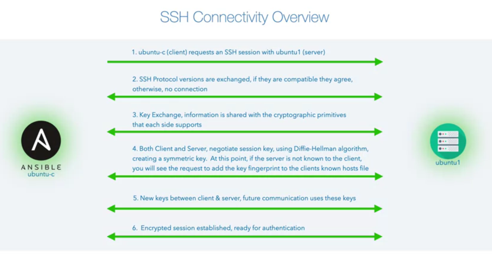

# <ins> Configuring SSH connectivity between hosts </ins> #

- ansible is an `agentless architecture` , for the `connectvity` to take place between the `Ansible` and `Our Target` a `trusted relation is required`

- with that `trusted relation` between the `ansible host` and the `target host` we can `login` using the `automated passwordless login`

- when we are using the `ssh` to connect to the `client` from `another server` then
  
  - when we request to connect to the `server` from `client host`  for example `ubuntu-c(client)` request connection `with ubuntu1(server)` then the `ubuntu-c(client) requests an SSH session with ubuntu1(server)` where `ssh connection betwween ubuntu-c(client) to ubuntu1(server)` which will `request` for `ssh-session`

  - both the `ubuntu-c(client) and ubuntu-1(server)` `exchange` the `SSH protocol version that they support` if the `SSH protocol version` `compatible` then they will `agree` `else connection stop at this point`

  - then a `"key exchange takes place" where info will shared with the "cryptographic primitive" that each side support`, after they agree on `cryptographic primitive`

  - once the `cryptographic primitive` being `agreed or supported by each end Both(client and Server)` then a `session key will be negotitated` using the `diffie-hellman algorithm` and create a `symmetric key`

  - at this point if the `server(ubuntu-1)` is not known to the `client (ubuntu-c)`

  - hence at this point(`if the server not known to the client`) we see the `prompt a message`  asking to `verify target fingereprint(yes/no)` which will be added to the `known_hosts` of the `client system`
  
  - once selected `yes` then that info will be stored to the `client(ubuntu-c)` in the `known_host` file 

  - now the `session` `established` and `in place` between the `client and server` then `new key are exchanged between the client and server` , going onwards `both client and server uses the new key that being genrated`

  - with the `new key` we have the `encrypted session established` between the `client and server` and `authentication` will going to happen

  - on success the `ubuntu1(server)` system will ask for the `password` to the `authenticate` hence we will getting a request for the `password`

  - here the `server(ubuntu1) and client(ubuntu-c)` `established` connection  using `secure channel` but not yet `authenticated` as we have not entered the `password`

  - once the `password` provided means we are authenticated and we can able to login to the `remote server that we requested `

  - we can use the command `exit` or `ctrl+d` in order to get out the `server back to the client from where we requested` 

  - 


# <ins> inspecting the known_host file in the client </ins> #

- the `kknown_hosts` will be `stored` to the `~/.ssh` folder which is a `hodden folder`

- we can use the `cat known_hosts` which will show the `content of the known_hosts file`

- we can see in the `known_hosts` file `2 entries` even though `we have allowed only one hostkey`

- when `client and server` try to connect then `if the server being unaware about the client` then it `save the fingerprint for both the host and IP address of the Server that we try to connect` when we `accepted the fingerprint` using the option as `yes`

- we can `generate` the `fingerprint of a Server` using the command as `ssh-keygen` for a particular `server` using the command as 

    ```
        ssh-keygen -F <hostname of the remote server>
        Or ssh-keygen -H -F <hostname of the remote server>
        # this command will help in getting the fingureprint for the host and if present in the known_hosts file shown that info as well

        # we can get the server ip address by pinging to it 
        # else it it is  docker container we can login and see the `hostname -i` command 
        
        ping <hostname of the remote server>
        # this will provide the IP address to me 

        ssh-keygen -H -F <ip address>
        # which will show the fingerprint based on the IP address of the remote server 
        # which should match to the second line of content in the known_hosts file

    ```

- if we delete the `known_hosts` file then `attempt to reconnect again` this will again ask us to `verify the fingerprint agin`

- we now have the good understanding of `ssh connection` we now see how thats related to `ansible` to `connect and manage` to `our system` without the `use of password`


# <ins> Password Less communication Between Ansible Host and Target Host </ins> #

- ansible uses the `ssh`, hence `in order to resolve it` we need to implement this in the `ssh-layer`

- when we have the `secure channel` established between the `ansible host` and the `target host` after accepting the `fingureprint` we will need to put the `password` which will securely `transfered to the target host using the secure channel securely` and once it `validated` then connection established

- but we don't want to enter the `password` through the `secure channel` everytime in order to login to the `remot server`

- hence if we want to `advoid putting password through the secure channel` then we need to the `SSH` to `create` the `public and private keys` and `those keys will be used for` the `access`

# <ins> How to connect the Ansible Host to Target Host using the Public and Private Keys </ins> #

- on the `ansible control host i.e. (ubkuntu-c)` in this case we will create `2 keys` named as `public and private key which will comprise to a key-pair`

- on the `target hosts or remote server (ubuntu1)` onn the `~/.ssh` folder we have the `authorized_keys` file that `allowing us to add` the `public key of our trusted host which is the ubuntu-c (ansible client)`

- with the `secure ssh channel established` , when `authenticating` the `private key of the ubuntu-c (ansible client / ansible host file )` will be used to vertify with the `public key of the authorized key` file of `target host`

- we can see the `public key file` the `<user>@<host>` been added at the end of the `file content`

- we can `copy` the `public key file content` to the `autorized key of the remote server or trusted hosts`

- but if we want to `copy manually` then we nee to make sure the `permission on the .ssh folder and the authorized_key file are correct` , otherwise the `ssh` will reject it 

- the `permission` will be `700` for the `.ssh folder` of the `target host` and `permission` will be off `600` for the `authorized_keys` files which present in `.ssh` folder  

- there is a `more efficient` way to do it using the command as `ssh-copy-id` which is a `tool bundled with ssh command`

- if we want to copy the `public key of the ansible client system` then we can use the command as `ssh-copy-id <username>@<remote server name>` , it will prompt for the `password` which will be `ansible trusted host password` then it will copy the `public key of the ubuntu-c(client) to the trusted host ubuntu server(ubuntu1)`

- now when we try to ssh to the `remote server` the `private key of the ansible host client` will be `validated` against the `trusted host authorized key public keypair` once validated then we can see the result in here 

- from the `next time onwards ` we don't need the `password` to access the `trusted host/ remote server`

- if we have the `fingerprint already setup between the cleint and server (now  the server know the client)` then we don't have to provide the `fingerprint permission` while using the `ssh-copy-id <username>@<host name>` but in case if we are trying to connect to the `trusted host/remote server` where the `fingerprint validation not happened (server don't know about the client)` then we can in that case the `fingerprint validation` also going to happen and `followed by password authenticatrion` then the `public key will be copied to the autorized_key of the remote server` when we are using the `ssh-copy-id <username>@<hostname>` command 

# <ins> connecting Multiple Target Host from Ansible Host </ins> #

- we need to copy our `public key` of the `ansible host` to the `set of target host` if we want to connect 

- we need to copy our  `public key` of the `ansible host` to the `set of target host` as both the `ansible and root user`

- we can do that manually `by using the ssh-copy-id` and taking the `fingerprint and password for each new target host` or we can automate it 

- we can install the `sshpass` using the command as `sudo apt update && sudo apt install sshpass` where `sudo means superuserdo`

- we will use the `sshpass` which will help in putting the `password` again and again for each new `target host / remote server`

- else we can use the `password.txt` file which contains the `password` in  order to `connect to multiple host` in this case

# <ins> How to connect the Ansible Host to Set of Target Host using the Public and Private Keys automatically using sshpass program </ins> #

- we can use the `custom script` for this purpose as below 

  ```
    # we can save the password to the password.txt file which we can later used for sshpass referece
    - echo password > password.txt # here we are writing the password to password.txt file

    # we can write down the below for loop in order to get the ansible host psswordless communication to target host
    for user in ansible root # as we are trying to login as both ansible and root user as 2 user
      do
        for os in ubuntu centos # here the operating system being ubuntu and centos 2 operating system
        do 
          for instance in 1 2 3 # as we have 3 instances for each of the OS file 
          do 
            sshpass -f password.txt ssh-copy-id -o StrictHostKeyChecking=no ${user}@${os}${instance}
            # here the sshpss command will use the password.txt file against the command which been prefixed into it which we want as the target command
            # sshpass uses the prefixed ssh command that we want to target
            # also we have the StrictHostKeyChecking which will help in automatically accept the fingerprint
            # this is a `ssh option which can be utilized with ssh-copy-id`
          done
        done
      done
  
  ```

# <ins> Quick Ansible to check for the connectivity </ins> #

- we can test an quick check to see whether the `ansible` able to connect to all the `target host` without a `password or not` with `both ansible or root user`
- here we will be using the `ansible executabnle which is a ansible command line` which can t`est the configuration that we build`

- where the `-i` option can be used the `ansible command or ansible executable` with this `-i` option we can define the `inventory file that we have`

- the `-i` option stands for the `inventory option`

- but we can also use a `comma i.e ,` with the `-i` option  `we can directly mention the inventory(target host) as a part of the command line using this , with -i option`

- the `all` which is used to specify the `" group of target hosts" that we want to target`

- by default in ansible `any target host` always added automatically to the `all target host group`

- this `all taget group` is the convient way to linking `all the host(inventory) we specified with -i option  with all the target host group`

- the `-m` specify the `ansible module` and here we are using the `module called ping`

- the `ping module` try to connect to the `target host` and will return the `pong` in case of `successful attempt`

- the command can be written as below 

  ```
      ansible -i,ubuntu1,ubuntu2,ubuntu3,centos1,centos2,centos3 all -m ping 
      # here -i is the incentory which can specify inventory file and also with comma we can specify the inventory( target host) directly on command line 
      # all is the target group which by default add any host into it 
      # the `-m` option used for module that we want to use here we are using the `ping module`
      # the ping module will return pong in response on successful connection 

  ```
