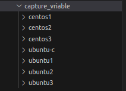

# <ins> Magic Variable in ansible </ins> #

- ansible has `variety` of `what is known as the magic variables`

- `magic variables` that are made `automatically made available` as a part of the `playbook fact gathering execution` using the `setup` module

- `hostsvars section of facts` can be considered as a `magic variable` using which we can capture the `hostvars as well as groupvars`

- documentation of `what is magic variable is very limited`, with the `new release of ansible` will be  the `new variables can be added or existing variuable can be updated`

- we can gather `all the ansible variable that are avaiable` so that `we can review and use it later`

- we can see all the `variable avialble for all hosts` will be a `logical approach`

- the documentation page of the `magic vaiable` being as 
  
  - [Ansible Magic Variable](https://docs.ansible.com/ansible/latest/reference_appendices/special_variables.html )    

- we know that all the `ansible_facts will be gathered for the hosts` using the `setup module` when we are `executing the ansible playbook`

- we can see the `ansible_facts which will be available as the variable for all the target hosts`  will be a better approach 

- if we want to fetch all  the `ansible_facts as variables for a specific or all the hosts` we can use the playbook as below 

- we can create a playbook for the same as below 

- but before to that we need to create the `JINJA2 template` where we will be getting the all the variable using the `to_nice_yaml` filter on the `vars` which will store all the ansible facts as variables and hostvars abd group and group_name

- for that we can define as below 

    ```
        ./template/variable_template.j2
        --------------------------------

        PLAYBOOK VARIABLE (vars):

        {{vars | to_nice_yaml}}
    
    ```


    ```
        variable_playbook.yaml
        ----------------------

        ---

        - hosts: all # here usinng the all target group
          tasks:
            - name: fetching the template from the template folder of ansible_host and converting to the required file using the JINJA2 templating engine
              template:  # using the template module in here 
                src: ./template/variable_template.j2 # defining the source templating JINJA2 template 
                dest: /tmp/ansible_variable # using the ansible_variable to define in the destination target host file 

            - name: using fetch module fetching that from the source file and provided into the dest file 
              fetch:  # using the fetch module in here 
                src: /tmp/ansible_variable  #fetching the value from the tyarget host defined in here 
                dest: ./capture_vriable/{{ansible_hostname}}  # based on the hostname we  are capturing that in the control host system

            - name: removing the file from the target host using the file module in here
              file:  # using the file module in here 
                path: /tmp/ansible_variable  # removing the file from the target hosts
                state: absent # using the sdtate as absent to delete a file

        ...
        # now we can execute the ansible_playbook as below 
        ansible-playbook variable_playbook.yaml
        # we can see the output in this case as below 

        PLAY [all] *****************************************************************************************************************************************************************************

        TASK [Gathering Facts] *****************************************************************************************************************************************************************
        ok: [ubuntu-c]
        ok: [centos3]
        ok: [centos2]
        ok: [centos1]
        ok: [ubuntu2]
        ok: [ubuntu1]
        ok: [ubuntu3]

        TASK [fetching the template from the template folder of ansible_host and converting to the required file using the JINJA2 templating engine] *******************************************
        changed: [ubuntu-c]
        changed: [centos2]
        changed: [centos1]
        changed: [centos3]
        changed: [ubuntu1]
        changed: [ubuntu2]
        changed: [ubuntu3]

        TASK [using fetch module fetching that from the source file and provided into the dest file] *******************************************************************************************
        changed: [ubuntu-c]
        changed: [centos1]
        changed: [centos3]
        changed: [centos2]
        changed: [ubuntu2]
        changed: [ubuntu1]
        changed: [ubuntu3]

        TASK [removing the file from the target host using the file module in here] ************************************************************************************************************
        changed: [ubuntu-c]
        changed: [centos1]
        changed: [centos3]
        changed: [centos2]
        changed: [ubuntu1]
        changed: [ubuntu2]
        changed: [ubuntu3]

        PLAY RECAP *****************************************************************************************************************************************************************************
        centos1                    : ok=4    changed=3    unreachable=0    failed=0    skipped=0    rescued=0    ignored=0   
        centos2                    : ok=4    changed=3    unreachable=0    failed=0    skipped=0    rescued=0    ignored=0   
        centos3                    : ok=4    changed=3    unreachable=0    failed=0    skipped=0    rescued=0    ignored=0   
        ubuntu-c                   : ok=4    changed=3    unreachable=0    failed=0    skipped=0    rescued=0    ignored=0   
        ubuntu1                    : ok=4    changed=3    unreachable=0    failed=0    skipped=0    rescued=0    ignored=0   
        ubuntu2                    : ok=4    changed=3    unreachable=0    failed=0    skipped=0    rescued=0    ignored=0   
        ubuntu3                    : ok=4    changed=3    unreachable=0    failed=0    skipped=0    rescued=0    ignored=0 
    
    
    ```

- as we have defined the `ansible_hostname` while definiing the `fetch module` we can uyse it as below 

- the folder structure will be as below where each host will be listed and inside that `ansible_variable` file being present 

    

- we can see the below section of the ansible_variable file 
  
  - `hostvars`
  
  - `groups`
  
  - `group_names`
  
  - `inventory_hostname`
  
  - `inventory_hostname_short`
  
  - `inventory_dir`
  
  - `inventory_file` 

