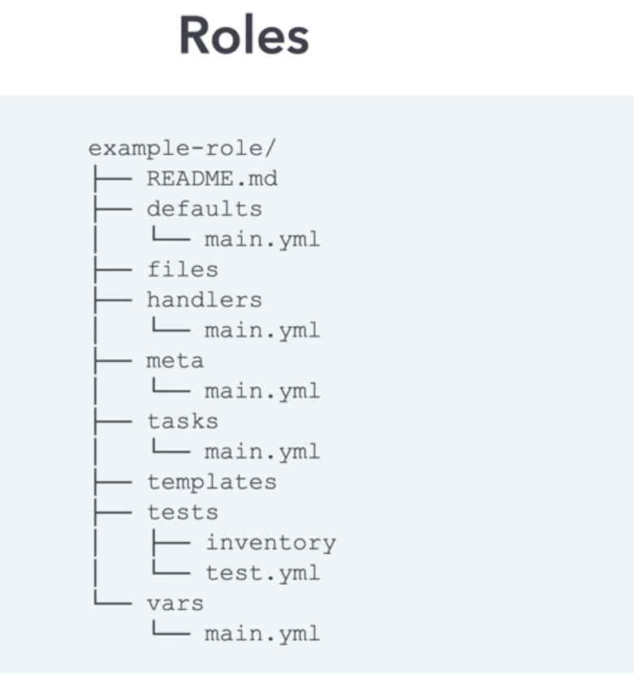

# Using Roles

- As we progress through the `use of the playbook` ,  we can see the `as the playbook expands` we `ended up convering a variety of different area`
- the `as the playbook expands` `we can see that` `we are using the template (JINJA2 template) and variables (variable yaml file)` from `different sources`
- for `manageablity and ease of use` `ansible roles are an excellent option/approach to use`
- `Roles allow us to` `structure and group` `playbook task and its associated component(handlers)` `into a roles` for `ease of consumption`
- here we will having a look over

  - `using role`
  - `the role structure`
  - `how to create roles with ansible galaxy`
  - `how to move an existing project to a role`
  - `role execution`
  - `role paramters`
  - `role dependencies`
- **Benifits of Using Roles**
- `Large Ansible Project` are `easier to manage`
- `roles are grouped with logical structure` `making them easier to share`
- `roles can be written, to a specific requirement`

  - for example
  - `Webserver role`
  - `DNS Role`
  - `patching role`
- `roles can be developed independently`, `in parallel by different entity`
- `templates and vars and files` `have designated directories` and `hene inclusion will be simpler`
- `roles can have dependencies on other role` , therefore `provide automatic inclusion`
- **Roles Structure**

  - 
  - A `roles` is `simply` `a directory structure` , with the `top level directory` `defining` the `name of the role`
  - we have the `defaults section or directory` where we will `save` all the `default variables for the roles`
  - we have the `files section or directory` , if we are using the `copy or script module` will be `very helpful` as `module` will `look for the associated files in here ` \
  - we also have the `handlers section or directory` where we need to define the `handler context`
  - - we are having the `meta section or directory` , `where all the setting related to the roles and dependencies will be stored`
  - we also have the `README.md` if we are `publishing the roles` then its a `good prectise to define the info in the markdown file such as README.md with the info of thr role`
  - we also have the `tasks section or directory` which will `include the tasks associated with the roles`
  - we also have the `tests section or directory` , `where we will save all the unit test with respect to the roles` and `if we are using the ansible-galaxy to install the roles then that will be executed as a part of the installation process `
  - we also gave the `templates section or directory` where we will put all the `JINJA2 template ending with *.j2`
  - we can see that `we have the vars section or directory` all the `raw variable with respect to the roles will be puuten into it`
- **Case01**

  - here we will take the `earlier nginx ansible project` and `convert them to Ansible roles`
  - we can see the `current directory structure` using the `find .` where `.` suggest the `current working directory`
  - we can create the `directory structure` as `defined earlier` `manually`
  - we can create the same with an ease `using the command as ansible-galaxy` which will be `useful to create the skeleton structure for the Ansible role`
  - we can create the `ansible role` using the command as `ansible-galaxy init <role name>`

  ```markdown
      - step-00:-> creating the `ansible role` as `nginx` by using the command as `ansible-galaxy init nginx` which will create the `skeleton directory structure`
      - step-01:-> this command will `create the required directory structure` for the `ansible role that we have mentioned i.e nginx`
      - step-02:-> then we can `copy the vars file` to the `vars folder in the ansible roles folder that got created i.e nginx/vars/main.yaml`
      - step-03:-> then we can `copy the JINJA2 template file` into the `template folder inside the ansible role that we have created nginx/templates directory main.yaml` file
      - step-04:-> we can also `copy the fiiles which will be used by other module` to the `nginx/files directory`
      - step-05:-> we can define the `handler context` in the `nginx/handlers/main.yaml` as below   

        ```
          nginx/handlers/main.yaml
          ========================
          ---

          # here we don't have to specify the  handlers segnment

          - name: Check HTTP Service # 
            uri:  # using the uri module in here 
              url: "http://{{ansible_default_ipv4.address}}"
              status_code:
                - 200
          ...
        
        ```

      - step-06:-> we need to `define the tasks` inside the `nginx/tasks/main.yaml` file as below without the `task` section of the `YAML file`

        ```
            nginx/tasks/main.yaml
            =====================
            ---

            - name: Install EPEL
              yum:
                name: epel-release
                update_cache: true
                state: latest
              when: ansible_distribution == "CentOS"
              tags:
              - install-epel

            - name: Install Nginx
              package:
                name: nginx
                state: latest
              tags:
              - install-nginx

            - name: Restart Nginx
              service:
                name: nginx
                state: restarted
              tags:
              - restart-nginx
              notify: check HTTP Service

            - name: Including the template into the target_dir
              template:
                src: index.html-easter_egg.j2   # here the template been referenced directly without mentioning the ./template/ndex.html-easter_egg.j2
                dest: "{{nginx_root_location}}/index.html"
                mode: 0644
              tags:
              - deploy-app

            - name: install unzip package
              package:
                name: unzip
                state: latest

            - name: Unarchieving the zip using the unarchive module
              unarchive:
                src: playbook_stacker.zip   # here the file been referenced directly without mentioning the ./files/ndex.html-easter_egg.j2
                dest: "{{nginx_root_location}}"
                mode: 0755
              tags:
              - deploy-app
            ...
        
        ```
      - step-07:-> now we can write the `ansible playbook` which will include the `roles` as below 

        ```
            nginx_playbook.yaml
            ===================
            ---

            - host: linux # targeting the linux host
              roles: #defining the roles with the roles attribute 
                - nginx # defining the roles as nginx
            ...
          
        ```

      - if we `execute the tasks` then we will be getting the `outcome` as below 

        ```
          # if we execute this with the playbook as below 
          ansible-playbook nginx_playbook.yaml
          # the below will be the outcome

          PLAY [linux] ***************************************************************************************************************************************************************************************

          TASK [Gathering Facts] *****************************************************************************************************************************************************************************
          ok: [centos2]
          ok: [centos1]
          ok: [centos3]
          ok: [ubuntu2]
          ok: [ubuntu1]
          ok: [ubuntu3]

          TASK [nginx : Install EPEL] ************************************************************************************************************************************************************************
          skipping: [ubuntu1]
          skipping: [ubuntu2]
          skipping: [ubuntu3]
          ok: [centos2]
          ok: [centos3]
          ok: [centos1]

          TASK [nginx : Install Nginx] ***********************************************************************************************************************************************************************
          ok: [centos2]
          ok: [centos3]
          ok: [centos1]
          ok: [ubuntu1]
          ok: [ubuntu2]
          ok: [ubuntu3]

          TASK [nginx : Restart nginx] ***********************************************************************************************************************************************************************
          changed: [ubuntu1]
          changed: [ubuntu2]
          changed: [centos3]
          changed: [centos1]
          changed: [ubuntu3]
          changed: [centos2]

          TASK [nginx : Template index.html-easter_egg.j2 to index.html on target] ***************************************************************************************************************************
          changed: [centos1]
          changed: [centos3]
          changed: [centos2]
          changed: [ubuntu1]
          changed: [ubuntu2]
          changed: [ubuntu3]

          TASK [nginx : Install unzip] ***********************************************************************************************************************************************************************
          ok: [centos1]
          ok: [centos2]
          ok: [centos3]
          ok: [ubuntu2]
          ok: [ubuntu1]
          ok: [ubuntu3]

          TASK [nginx : Unarchive playbook stacker game] *****************************************************************************************************************************************************
          ok: [centos3]
          ok: [centos1]
          ok: [centos2]
          ok: [ubuntu1]
          ok: [ubuntu2]
          ok: [ubuntu3]

          RUNNING HANDLER [nginx : Check HTTP Service] *******************************************************************************************************************************************************
          ok: [centos2]
          ok: [ubuntu2]
          ok: [ubuntu1]
          ok: [centos1]
          ok: [centos3]
          ok: [ubuntu3]

          PLAY RECAP *****************************************************************************************************************************************************************************************
          centos1                    : ok=8    changed=2    unreachable=0    failed=0    skipped=0    rescued=0    ignored=0   
          centos2                    : ok=8    changed=2    unreachable=0    failed=0    skipped=0    rescued=0    ignored=0   
          centos3                    : ok=8    changed=2    unreachable=0    failed=0    skipped=0    rescued=0    ignored=0   
          ubuntu1                    : ok=7    changed=2    unreachable=0    failed=0    skipped=1    rescued=0    ignored=0   
          ubuntu2                    : ok=7    changed=2    unreachable=0    failed=0    skipped=1    rescued=0    ignored=0   
          ubuntu3                    : ok=7    changed=2    unreachable=0    failed=0    skipped=1    rescued=0    ignored=0  
                  
        
        ```

  ```

  - **case02**
    
    - we can see that we have `only one role` i.e `nginx` , `which can be reused ` that have currenyly all the `tasks` associated with it 
    
    - Arguably the `webpage itself ` could be `a separate roles` 
    
    - hence we can `create another role` called `webapp` and `segregate the nginx task to nginx and webapp related package to the webapp role`
    
    - which can be defined as below 

      ```markdown
          - step-00:-> creating the `ansible role` as `webapp` by using the command as `ansible-galaxy init webapp` which will create the `skeleton folder for ansible role`
          - step-01:-> this command will `create the required directory structure` for the `ansible role that we have mentioned i.e webapp`
          - step-02:-> then we can `copy the vars file from the nginx/vars/main.yaml` to the `webapp/vars/main.yaml`
          - step-03:-> then we can `copy the JINJA2 template file from nginx/templates` into the `webapp/templates` folder
          - step-04:-> we can also `copy the files which will be used by other module ferom nginx/files` to the `webapp/files directory`
          - above things will be needed by the `webapp` not by the `nginx` hence we are moving to the `webapp ansible roles`
          - step-05:-> we can keep the `handlers` as it is as we have the `corresponsing task restart-nginx which will trigger the handler context to run`
          - step06:- we can `separate the nginx related tasks` and `webapp related tasks` from the `overall tasks in nginx/tasks` as below 

          ```
            nginx/tasks/main.yaml
            =====================
            ---

            - name: Install EPEL
              yum:
                name: epel-release
                update_cache: true
                state: latest
              when: ansible_distribution == "CentOS"
              tags:
              - install-epel

            - name: Install Nginx
              package:
                name: nginx
                state: latest
              tags:
              - install-nginx

            - name: Restart Nginx
              service:
                name: nginx
                state: restarted
              tags:
              - restart-nginx
              notify: check HTTP Service  
            
            ...
        
          ``` 

        - step07:- we can define the `webapp related tasks` as below

          ```
            webapp/tasks/main.yaml
            ======================

            ---

            - name: Including the template into the target_dir
              template:
                src: index.html-easter_egg.j2
                dest: "{{nginx_root_location}}/index.html"
                mode: 0644
              tags:
              - deploy-app

            - name: install unzip package
              package:
                name: unzip
                state: latest

            - name: Unarchieving the zip using the unarchive module
              unarchive:
                src: playbook_stacker.zip
                dest: "{{nginx_root_location}}"
                mode: 0755
              tags:
              - deploy-app

            ...
          
          
          ``` 
          - now we also have to modify the `ansible-playbook` and include the `webapp roles into it` as below 

          ```
            nginx_webapp_playbook.yaml
            ==========================
            ---

            - host: linux # targeting the linux host
              roles: #defining the roles with the roles attribute 
                - nginx # defining the roles as nginx
                - webapp # including the webapp roles in here 
            ...

          ```

        ## if we execute this with the playbook as below 
        ansible-playbook nginx_webapp_playbook.yaml
        # the below will be the outcome
        
        
        PLAY [linux] ***************************************************************************************************************************************************************************************

        TASK [Gathering Facts] *****************************************************************************************************************************************************************************
        ok: [centos1]
        ok: [centos3]
        ok: [centos2]
        ok: [ubuntu2]
        ok: [ubuntu1]
        ok: [ubuntu3]

        TASK [nginx : Install EPEL] ************************************************************************************************************************************************************************
        skipping: [ubuntu1]
        skipping: [ubuntu2]
        skipping: [ubuntu3]
        ok: [centos1]
        ok: [centos3]
        ok: [centos2]

        TASK [nginx : Install Nginx] ***********************************************************************************************************************************************************************
        ok: [centos1]
        ok: [centos2]
        ok: [centos3]
        ok: [ubuntu1]
        ok: [ubuntu2]
        ok: [ubuntu3]

        TASK [nginx : Restart nginx] ***********************************************************************************************************************************************************************
        changed: [ubuntu2]
        changed: [centos3]
        changed: [centos1]
        changed: [ubuntu1]
        changed: [centos2]
        changed: [ubuntu3]

        TASK [webapp : Template index.html.j2 to index.html on target] *************************************************************************************************************************************
        ok: [centos2]
        ok: [centos1]
        ok: [centos3]
        ok: [ubuntu1]
        ok: [ubuntu2]
        ok: [ubuntu3]

        TASK [webapp : Install unzip] **********************************************************************************************************************************************************************
        ok: [centos3]
        ok: [centos2]
        ok: [centos1]
        ok: [ubuntu1]
        ok: [ubuntu2]
        ok: [ubuntu3]

        TASK [webapp : Unarchive playbook stacker game] ****************************************************************************************************************************************************
        ok: [centos1]
        ok: [centos2]
        ok: [centos3]
        ok: [ubuntu2]
        ok: [ubuntu1]
        ok: [ubuntu3]

        RUNNING HANDLER [nginx : Check HTTP Service] *******************************************************************************************************************************************************
        ok: [ubuntu2]
        ok: [ubuntu1]
        ok: [centos1]
        ok: [centos2]
        ok: [centos3]
        ok: [ubuntu3]

        PLAY RECAP *****************************************************************************************************************************************************************************************
        centos1                    : ok=8    changed=1    unreachable=0    failed=0    skipped=0    rescued=0    ignored=0   
        centos2                    : ok=8    changed=1    unreachable=0    failed=0    skipped=0    rescued=0    ignored=0   
        centos3                    : ok=8    changed=1    unreachable=0    failed=0    skipped=0    rescued=0    ignored=0   
        ubuntu1                    : ok=7    changed=1    unreachable=0    failed=0    skipped=1    rescued=0    ignored=0   
        ubuntu2                    : ok=7    changed=1    unreachable=0    failed=0    skipped=1    rescued=0    ignored=0   
        ubuntu3                    : ok=7    changed=1    unreachable=0    failed=0    skipped=1    rescued=0    ignored=0 
      
      
    
      ```

- **Roles Parameter**

- when we are `processing the oputput` we can see that `corresponding roles been mentioned against the Task that been defined`

- here we have `2 roles`
  
  - `nginx role` will help in `deploying the mginx to Ubuntu or Centos OS`
  
  - we also have the `webapp role` using which we will be able to `deploy our webapp to the installed nginx on Ubuntu or centos System`   

- the `destination for deploying the webapp on the installed nginx of Ubuntu and CentOS` been provided in the `groupvars of Ubuntu and centos respectively as of now`

- but one think to notice in here `we are using the nginx_root_location` which is being defined in the `groupvars` for the `webapp` role

- which we can define inside the `webapp/defaults/main.yaml` file which can be act as the `ansible role paramter`

- but as the `variable can be declared once we need to handle it dynamically using the JINJA2 template in the playbook yaml`

- when we are executing with the `ansible roles structure` in anyu case `if tasks failed for a target host` then the `next task will not be run for those target hosts` 

- which we can write as below `webapp/defaults/main.yaml` and `corresponding webapp/taskss/main.yaml` and `nginx_webapp_playbook.yaml` as below 

  ```
      webapp/defaults/main.yaml
      =========================
      ---
      taget_dir: /var/www/html # here inside the defaults folder we can define the variable which is the location for the ubuntu , now if run for centos throw error
      ...

      # hence we first need to fix the tasks accordingly
      
      webapp/tasks/main.yaml
      =======================
      ---

            - name: Including the template into the target_dir
              template:
                src: index.html-easter_egg.j2
                dest: "{{tatget_dir}}/index.html"  # here the nginx_root_location been changed to tatget_dir which is a default variable,we can remove the same from groupvars
                mode: 0644
              tags:
              - deploy-app

            - name: install unzip package
              package:
                name: unzip
                state: latest

            - name: Unarchieving the zip using the unarchive module
              unarchive:
                src: playbook_stacker.zip
                dest: "{{tatget_dir}}"  # here the nginx_root_location been changed to tatget_dir which is a default variable,we can remove the same from groupvars
                mode: 0755
              tags:
              - deploy-app

      ...
  
  
  ```

- hence when we run now then in that case we will be getting the error as centos doesn't have the `nginx at that location`
- hence we need to modify the playbook as below using the dynamic JIBJA2 tempating

      ```
            nginx_webapp_playbook.yaml
            ==========================
            ---

            - host: linux # targeting the linux host
              roles: #defining the roles with the roles attribute 
                - nginx # defining the roles as nginx
                - {role: webapp, target_dir: "/usr/share/nginx/html/var/www/html"}
                  # this is an alternate way of using the roles inside the roles derivative using it as the dictionary 
            ...

            ## if we execute this with the playbook as below 
            ansible-playbook nginx_webapp_playbook.yaml
            # the below will be the outcome


              PLAY [linux] ***************************************************************************************************************************************************************************************

              TASK [Gathering Facts] *****************************************************************************************************************************************************************************
              ok: [centos2]
              ok: [centos3]
              ok: [centos1]
              ok: [ubuntu2]
              ok: [ubuntu1]
              ok: [ubuntu3]

              TASK [nginx : Install EPEL] ************************************************************************************************************************************************************************
              skipping: [ubuntu1]
              skipping: [ubuntu2]
              skipping: [ubuntu3]
              ok: [centos1]
              ok: [centos2]
              ok: [centos3]

              TASK [nginx : Install Nginx] ***********************************************************************************************************************************************************************
              ok: [centos1]
              ok: [centos3]
              ok: [centos2]
              ok: [ubuntu3]
              ok: [ubuntu2]
              ok: [ubuntu1]

              TASK [nginx : Restart Nginx] ***********************************************************************************************************************************************************************
              changed: [centos3]
              changed: [ubuntu2]
              changed: [centos2]
              changed: [ubuntu3]
              changed: [centos1]
              changed: [ubuntu1]

              TASK [webapp : Including the template into the target_dir] *****************************************************************************************************************************************
              changed: [centos1]
              changed: [centos2]
              changed: [centos3]
              changed: [ubuntu1]
              changed: [ubuntu2]
              changed: [ubuntu3]

              TASK [webapp : install unzip package] **************************************************************************************************************************************************************
              ok: [centos2]
              ok: [centos1]
              ok: [centos3]
              ok: [ubuntu1]
              ok: [ubuntu2]
              ok: [ubuntu3]

              TASK [webapp : Unarchieving the zip using the unarchive module] ************************************************************************************************************************************
              ok: [centos1]
              ok: [centos2]
              ok: [centos3]
              ok: [ubuntu2]
              ok: [ubuntu1]
              ok: [ubuntu3]

              RUNNING HANDLER [nginx : check HTTP Service] *******************************************************************************************************************************************************
              ok: [ubuntu3]
              ok: [centos1]
              ok: [centos3]
              ok: [centos2]
              ok: [ubuntu2]
              ok: [ubuntu1]

              PLAY RECAP *****************************************************************************************************************************************************************************************
              centos1                    : ok=8    changed=2    unreachable=0    failed=0    skipped=0    rescued=0    ignored=0   
              centos2                    : ok=8    changed=2    unreachable=0    failed=0    skipped=0    rescued=0    ignored=0   
              centos3                    : ok=8    changed=2    unreachable=0    failed=0    skipped=0    rescued=0    ignored=0   
              ubuntu1                    : ok=7    changed=2    unreachable=0    failed=0    skipped=1    rescued=0    ignored=0   
              ubuntu2                    : ok=7    changed=2    unreachable=0    failed=0    skipped=1    rescued=0    ignored=0   
              ubuntu3                    : ok=7    changed=2    unreachable=0    failed=0    skipped=1    rescued=0    ignored=0 


      ``` 

- here we can see that `webapp role` being dependent on the `nginx role` hene we can also show this `dependecies` in the `webapp/meta/main.yaml` file where we can specify the `depdendent role` in the `depedecies section`

- and once deined then we can remove the `role as nginx` from the `main book` as its a `part of webapp role` when the `webapp role ran then automatically the nginx rle will also run`

- the `output in both the case will be similar`


      ```
        step01:-> include the nginx dependencies to webapp/meta/main.yaml

        step02:->  redefine the ansible playbook in here

            nginx_webapp_playbook.yaml
            ==========================
            ---

            - host: linux # targeting the linux host
              roles: #defining the roles with the roles attribute 
                - {role: webapp, target_dir: "/usr/share/nginx/html/var/www/html"}
            ...

            ## if we execute this with the playbook as below 
            ansible-playbook nginx_webapp_playbook.yaml
            # the below will be the outcome


              PLAY [linux] ***************************************************************************************************************************************************************************************

              TASK [Gathering Facts] *****************************************************************************************************************************************************************************
              ok: [centos2]
              ok: [centos3]
              ok: [centos1]
              ok: [ubuntu2]
              ok: [ubuntu1]
              ok: [ubuntu3]

              TASK [nginx : Install EPEL] ************************************************************************************************************************************************************************
              skipping: [ubuntu1]
              skipping: [ubuntu2]
              skipping: [ubuntu3]
              ok: [centos1]
              ok: [centos2]
              ok: [centos3]

              TASK [nginx : Install Nginx] ***********************************************************************************************************************************************************************
              ok: [centos1]
              ok: [centos3]
              ok: [centos2]
              ok: [ubuntu3]
              ok: [ubuntu2]
              ok: [ubuntu1]

              TASK [nginx : Restart Nginx] ***********************************************************************************************************************************************************************
              changed: [centos3]
              changed: [ubuntu2]
              changed: [centos2]
              changed: [ubuntu3]
              changed: [centos1]
              changed: [ubuntu1]

              TASK [webapp : Including the template into the target_dir] *****************************************************************************************************************************************
              changed: [centos1]
              changed: [centos2]
              changed: [centos3]
              changed: [ubuntu1]
              changed: [ubuntu2]
              changed: [ubuntu3]

              TASK [webapp : install unzip package] **************************************************************************************************************************************************************
              ok: [centos2]
              ok: [centos1]
              ok: [centos3]
              ok: [ubuntu1]
              ok: [ubuntu2]
              ok: [ubuntu3]

              TASK [webapp : Unarchieving the zip using the unarchive module] ************************************************************************************************************************************
              ok: [centos1]
              ok: [centos2]
              ok: [centos3]
              ok: [ubuntu2]
              ok: [ubuntu1]
              ok: [ubuntu3]

              RUNNING HANDLER [nginx : check HTTP Service] *******************************************************************************************************************************************************
              ok: [ubuntu3]
              ok: [centos1]
              ok: [centos3]
              ok: [centos2]
              ok: [ubuntu2]
              ok: [ubuntu1]

              PLAY RECAP *****************************************************************************************************************************************************************************************
              centos1                    : ok=8    changed=2    unreachable=0    failed=0    skipped=0    rescued=0    ignored=0   
              centos2                    : ok=8    changed=2    unreachable=0    failed=0    skipped=0    rescued=0    ignored=0   
              centos3                    : ok=8    changed=2    unreachable=0    failed=0    skipped=0    rescued=0    ignored=0   
              ubuntu1                    : ok=7    changed=2    unreachable=0    failed=0    skipped=1    rescued=0    ignored=0   
              ubuntu2                    : ok=7    changed=2    unreachable=0    failed=0    skipped=1    rescued=0    ignored=0   
              ubuntu3                    : ok=7    changed=2    unreachable=0    failed=0    skipped=1    rescued=0    ignored=0 

      ``` 

      

  
  
  
  
  


